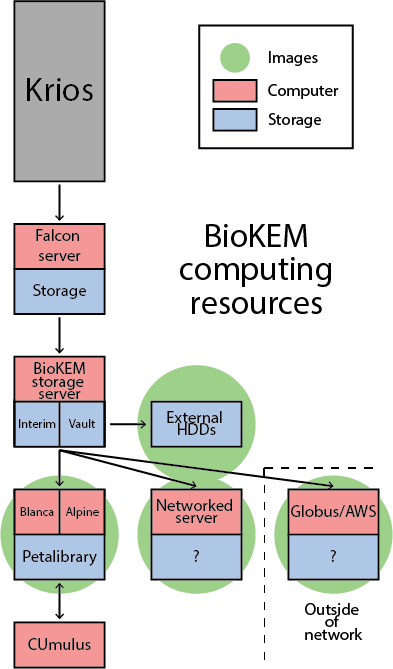

Getting your data
=================

As images come off the scope they will be placed into your lab's
``interim_storage`` folder and stored for two weeks before they are
automatically deleted. If you are unable to collect your images before
then, please contact the facility manager to make other arrangements.

.. _Push:

Push to Petalibrary (*Preferred method*)
----------------------------------------
The preferred method of getting your data from the BioKEM facility is to have us
push it to your `biokem-deposit` folder in your lab's Petalibrary. We can do
this in real time so you can start processing data as it comes off the scope
(:doc:`processing/otf_motion_correction`). We will need to set up a few things to
get this working for your lab, so make sure to contact the facility in advance
for initial setup.

You'll need:
  - PetaLibrary allocation
  - Specially configured ``biokem-deposit`` folder
  - Have BioKEM mount your folder to the storage drive
  - Have BioKEM setup entry in auto-push script

.. _Globus:

Globus
------
The biokem-storage server has a Globus endpoint configured, which allows users
outside (or inside, if not better method exists) to transfer their data through
Globus. The is a fairly secure option, although it can be slow.

#. Logon to the biokem-storage server.
#. Start screen for running client in:

    .. code-block:: bash

      screen -S globus

#. Log into your globus client:

    .. code-block:: bash

      globus login

#. Copy and paste hyperlink into web browser.
#. Code will be generated.
#. Copy and paste code into biokem-storage terminal.
#. Start the Globus connect:

    .. code-block:: bash

      ./home/biokem_manager/software/globus/globusconnectpersonal-3.1.5/globusconnectpersonal -start &

#. Detach from the screen:

    .. code-block:: bash

     ctrl+AD

#. Then, start the transfer on the Globus Connect GUI.

.. _AWS:

AWS
---
If your lab/organization is user of AWS you may have your data dropped into an
AWS bucket. (We are still setting this up)

.. _server:

Sync to networked server
------------------------
A secure and slightly slower alternative to Petalibrary is to transfer your data
to a server your lab owns on CU's network. Once the BioKEM manager sets you up
with a user account on the biokem-storage server you will be able to use an
``rsync`` command to transfer your data to your server from the
``interim_storage`` folder. Example command to run from your workstation:

  .. code-block:: bash

    screen -S transfer
    rsync -auP <user_name>@biokem-storage.int.colorado.edu:/data/interim_storage/<lab-folder>/<collection_name>
    ctrl+ad

To reattach to the screen later:

  .. code-block:: bash

    screen -r transfer

.. _HDD:

External hard drive (*Discouraged method*)
------------------------------------------
Transferring data via physically transporting an external hard drive is discouraged,
as these disks are non-redundant, slow, and prone to physical damage. But if none of
the other methods are available to you  you may drop off a hard drive to transfer
your data.
