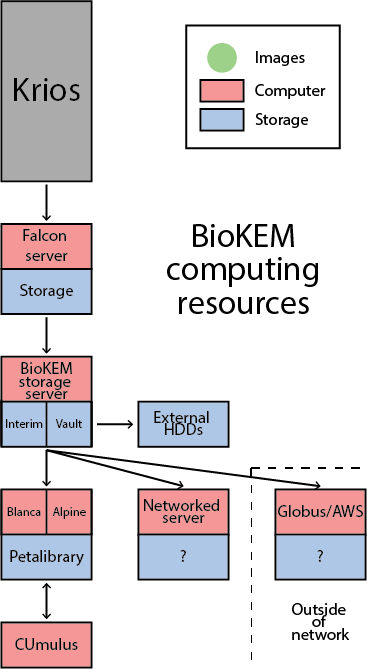

.. BioKEM documentation master file, created by
   sphinx-quickstart on Mon Nov 22 16:38:12 2021.
   You can adapt this file completely to your liking, but it should at least
   contain the root `toctree` directive.

Welcome to BioKEM's documentation!
=======================================
The University of Colorado Boulder Biochemistry Department's Krios Electron
Microscopy facility (BioKEM) offers single particle cryo-EM and cryo-ET of
plunge-frozen samples using a Titan Krios G3i with a Gatan K3 Direct Detection
Camera. You are likely looking for :doc:`/processing/how_to`.

.. toctree::
   :maxdepth: 2

   faqs
   collecting
   getting
   storing
   processing
   external_links

For addition technical help please contact Chuck Moe (charles.moe@colorado.edu). For 
additional help with the Blanca computing cluster or Petalibrary refer to 
`RC's doccumentation page <https://curc.readthedocs.io/en/latest/index.html>`_.
Email rc-help@colorado.edu if additional help is needed.
