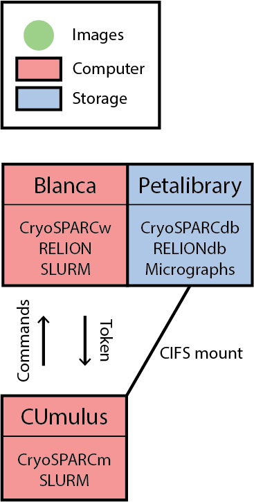

On-the-fly motion correction
============================

CryoSPARC Live
--------------
To use CryoSPARC Live we will configure a virtual machine hosted on CUmulus and 
set up your lab's PL allocation for file pushing from the storage server.
See :doc:`using_software/cryosparc` for usage.

RelionOTF
---------
RELION on-the-fly can be ran through the SBGrid installation on the cluster, again
you will need to make sure your lab's PL is porperly configure for file pushing.
See `here <https://relion.readthedocs.io/en/release-4.0/Onthefly.html>`_ for more.
