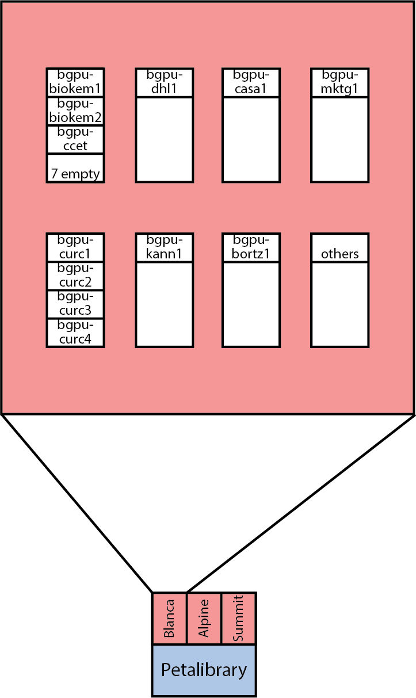

Processing resources
====================
This section will provide descriptions of the systems associate with BioKEM, for
technical guides on how to use the systems, see :doc:`/processing/how_to`.

    - :ref:`Petalibrary`
    - :ref:`Blanca-biokem`
    - :ref:`Blanca-viz`
    - :ref:`CUmulus`
    - :ref:`SLURM`
    - :ref:`SBGrid`

.. _Petalibrary:

Petalibrary
-----------
`Petalibrary <https://www.colorado.edu/rc/resources/petalibrary>`__ is CU's
Research Computing (RC) files storage system. This service can be used to safely
and securely store 100's of TBs of data for a modest cost. This system is well
backed up, so you don't have to worry about losing valuable data. The other
important aspect of this service is that you can securely mount it to other RC
resources like Blanca for super fast file transfer.

You will need to request and allocation for you lab and have RC create a
biokem-deposit folder that can be used to deposit images taken from the Krios.
See https://www.colorado.edu/rc/resources/petalibrary for more information and
email rc-help@colorado.edu to request and allocation. We recommend requesting an
allocation of about ~20TB/actively processing dataset. This service could also
be a good long term storage option for already processed datasets.

.. _Blanca-biokem:

Blanca-biokem
-------------
`Blanca <https://www.colorado.edu/rc/resources/blanca>`__ is RC's condo computing
cluster. This cluster allows users to purchase their own computing nodes that RC
will then house, setup, and manage. Users have priority on the nodes they own,
but have access to use other users nodes when they are available. The BioKEM
facility owns two types of nodes: one reserved for on the fly motion correction
and the other for users of the facility to process EM data. The physical space
we are allotted can house up to 10 processing nodes in addition to the on the
fly node. These nodes are purchased by individual labs, but are then shared by
all members of the BioKEM facility. Each node will consist of a number of GPUs
(typically 4) and CPUs. All jobs ran in the cluster are submitted by a workload
manager called :ref:`SLURM`.

.. _Blanca-viz:

Blanca-viz
----------
In addition to the processing, login and compile nodes on Blanca, there are two
GPU-accelerated visualization nodes that allow users to run graphical user
interfaces, like ChimeraX. This is done through a web-based portal called
`CURC Open OnDemand <https://ondemand.rc.colorado.edu>`__ and is how
even command line based computing should be done on Blanca.

.. _CUmulus:

CUmulus
--------
In addition to the Blanca computing cluster, users from CU also have the option
to access
`CUmulus <https://curc.readthedocs.io/en/latest/hybrid-cloud/cumulus.html>`__.
CUmulus is CU's cloud computing service that allows users to create virtual
machines to fill specific roles that Blanca cannot perform for security or job
limitation reasons. Two specific uses of this resource are: hosting a persistent
job such as a CryoSPARC master instance or setting up a webpage. Clonable VMs
to accomplish these tasks will be available to BioKEM users soon.

.. _SLURM:

SLURM
-----
`SLURM <https://slurm.schedmd.com>`__ is the management system many computing
clusters, including Blanca use to run jobs. It allows multiple users to use the
same computing resources by distributing jobs across resources and scheduling
jobs to start when resources become available. The main benefits to us of using
SLURM are:

   - Maximize utilization of nodes by running 24/7
   - Avoid single users from hogging resources
   - Create easy to replicate workflows
   - Allows us to use non-BioKEM nodes when they are available

All of these will bring the cost of high performance computing per lab down
drastically, while working within a consistent compute environment that should
be easier for the community to troubleshoot than working in individual labs.

.. _SBGrid:

SBGrid
------
To manage all of the software necessary for processing EM data, we are using a
software manager called `SBGrid <https://sbgrid.org>`__. This service allows us to
maintain multiple versions of software, as well as easily install and update new
software. General members of the EM community may use a basic set of software
under the facility's license including:

   - crYOLO
   - CTFFind
   - cryoDRGN
   - deepEMhancer
   - MotionCor2
   - PyEM
   - Relion

Labs interested in using the suite of ~400 programs must purchase a lab specific
license from SBGrid, we will then grant lab members access to these
applications.

Commercial users are limited to a few preprocessing applications without an
additional license.
