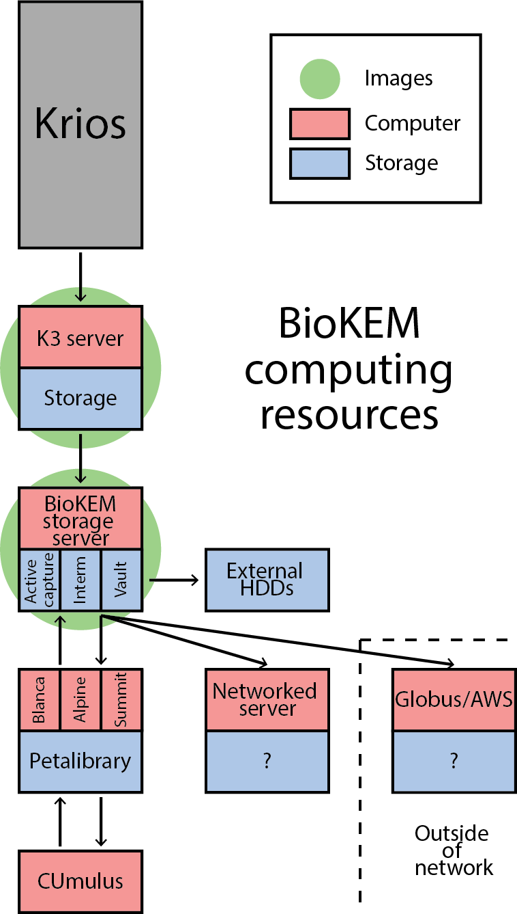

Storing data
============

This guide will detail the storage options avaible to BioKEM users, as well as their 
limitations. 

General flow
------------
The BioKEM facility has a number of storage devices for different applications:

    - :ref:`K3 server`
    - :ref:`Active capture`
    - :ref:`Interm storage`
    - :ref:`Vault`

+----------------+--------+-------+----------+----------------------------+
| Device         | Size   | Type  | User     | Length of storage          |
+----------------+--------+-------+----------+----------------------------+
| K3 Server      | 10TB   | RAID0 | Facility | Minutes (during capture)   |
+----------------+--------+-------+----------+----------------------------+
| Active capture | 109TB* | RAID6 | Facility | Days (duration of capture) |
+----------------+--------+-------+----------+----------------------------+
| Interm storage | 109TB* | RAID6 | User     | 2 weeks (auto deleted)     |
+----------------+--------+-------+----------+----------------------------+
| Vault          | 58TB   | RAID6 | External | 3 months                   |
+----------------+--------+-------+----------+----------------------------+
*109TB shared between Active and Interm 

.. _K3 server:

K3 server
---------
The K3 server contains 10TB of RAID0 storage for storing images directly off of the K3
camera. This is enough storage for roughly one week of data collection, however this
storage device is not redundant on its own, so data is push live to the 
:ref:`Active capture` partition of the biokem-storage server. 

.. _Active capture:

Active capture
--------------
The active-capture partition is part of the RAID6 storage device on the biokem-storage
server. Data is shunted from the K3 server directly to here. The advantange of this
is the data transfer is local and can be performed in the event of an internet outage.
This partition is on the same device as :ref:`Interm storage`, together they have 
109TB of RAID6 storage. Data is only stored here while actively capturing it.  

.. _Interm storage:

Interm storage
--------------
Interm storage is a costumer facing partition of the biokem-storage device. This is
from where users can pull their data. Combined with :ref:`Active capture` it has 
109TB of RAID6 storage. Data is automatically deleted after 2 weeks **no exceptions**. 

.. _Vault:

Vault
-----
The Vault is a separate RAID6 storage device within the biokem-storage server with
a capacity of 58TB. This partition is used to archive external users' data, if they
require a redundant backup. Storage on this device is limited to 3 months.   

